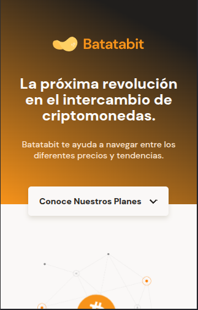
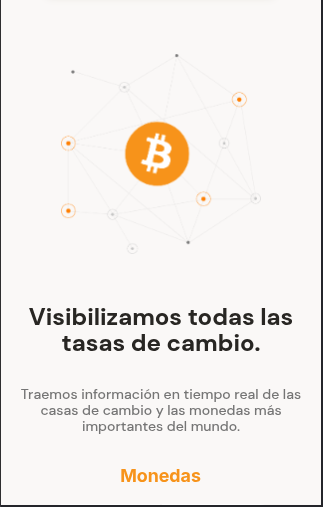
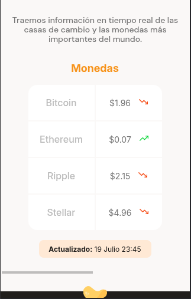
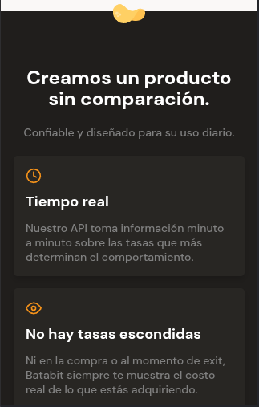
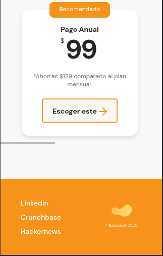

# Descripción del Repositorio
- Este repositorio contiene un proyecto de un sitios web adaptable con Responsive Design a Mobile First, tablet y desktop.

## Tecnologias utilizadas
- Para la realizacion de este proyecto se utilizaron las siguientes tecnologias:
  - [Html](https://developer.mozilla.org/es/docs/Web/HTML): Lenguaje de marcado para esrtuctura basica del proyecto en la web.
  - [Css](https://developer.mozilla.org/es/docs/Web/CSS): Lenguaje de estilos para dar presentacion al proyecto web.

## Link del proyecto en la web
- [responsive design](https://responsive-design-mobile-first.netlify.app/).

## Imagenes del proyecto

- Header

- Main

- tables

- Cards

- Plans

- Footer

